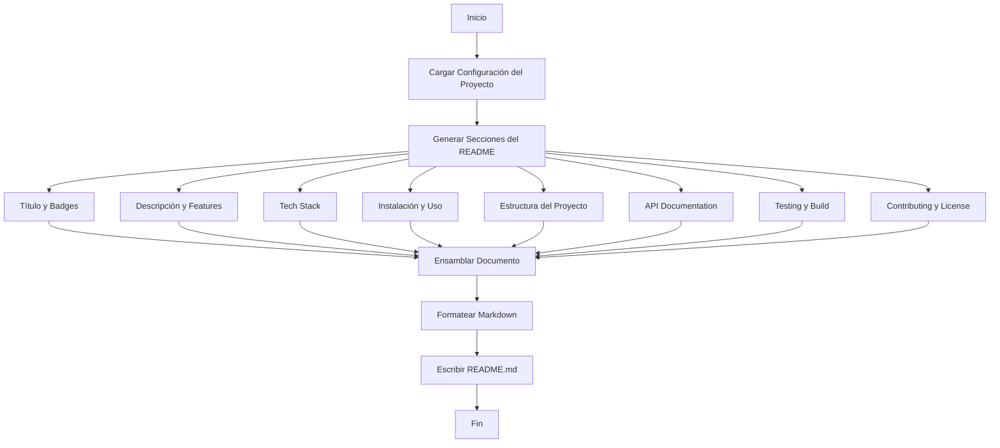

# Documento de Diseño: README Profesional

## Overview

Este diseño especifica la implementación de un generador de README profesional para el proyecto "Reporte de Servicios". El generador creará un archivo README.md completo y bien estructurado que sirva como punto de entrada principal para desarrolladores, usuarios finales y colaboradores.

El README generado seguirá las mejores prácticas de documentación de proyectos open source, incluyendo estructura clara, badges informativos, instrucciones detalladas de instalación y uso, y enlaces a documentación adicional. Todo el contenido estará en español, manteniendo consistencia con la documentación existente del proyecto.

### Objetivos del Diseño

1. Crear un README que cumpla con estándares profesionales de la industria
2. Proporcionar información clara y accesible para diferentes audiencias (developers, end users, contributors)
3. Integrar referencias a la documentación existente en docs/
4. Facilitar la incorporación de nuevos colaboradores al proyecto
5. Documentar el proceso de build y distribución para Windows

## Architecture

### Componentes Principales

El sistema de generación del README se compone de los siguientes elementos:

1. **Template Engine**: Motor de plantillas que genera el contenido Markdown
2. **Content Providers**: Módulos que proporcionan información específica (badges, tech stack, estructura de proyecto)
3. **Markdown Formatter**: Utilidades para formatear correctamente el contenido Markdown
4. **File Writer**: Componente que escribe el README.md en el directorio raíz

### Flujo de Generación



### Decisiones de Arquitectura

1. **Generación Programática vs Manual**: Se opta por un script de generación que puede ser ejecutado cuando sea necesario, permitiendo actualizaciones consistentes del README cuando cambien aspectos del proyecto.

2. **Plantillas vs Código Directo**: Se utilizará código Python con f-strings para generar el contenido, lo que permite mayor flexibilidad y validación en tiempo de ejecución.

3. **Modularidad**: Cada sección del README se generará mediante funciones independientes, facilitando el mantenimiento y las pruebas.

## Components and Interfaces

### 1. ReadmeGenerator (Clase Principal)

```python
class ReadmeGenerator:
    """Generador principal del archivo README.md"""
    
    def __init__(self, project_root: Path):
        """Inicializa el generador con la ruta raíz del proyecto"""
        
    def generate(self) -> str:
        """Genera el contenido completo del README"""
        
    def write_to_file(self, output_path: Path) -> None:
        """Escribe el README generado en el archivo especificado"""
```

### 2. SectionGenerators (Módulo de Generadores de Secciones)

```python
def generate_header() -> str:
    """Genera título, badges y tabla de contenidos"""
    
def generate_description() -> str:
    """Genera descripción del proyecto y lista de features"""
    
def generate_tech_stack() -> str:
    """Genera la sección de stack tecnológico"""
    
def generate_installation() -> str:
    """Genera instrucciones de instalación para developers"""
    
def generate_usage() -> str:
    """Genera instrucciones de uso para desarrollo"""
    
def generate_end_user_guide() -> str:
    """Genera guía simplificada para usuarios finales"""
    
def generate_project_structure() -> str:
    """Genera árbol de estructura del proyecto"""
    
def generate_api_docs() -> str:
    """Genera referencia rápida de API endpoints"""
    
def generate_testing() -> str:
    """Genera sección de testing"""
    
def generate_build_instructions() -> str:
    """Genera instrucciones de build para Windows"""
    
def generate_contributing() -> str:
    """Genera guía de contribución"""
    
def generate_license_contact() -> str:
    """Genera información de licencia y contacto"""
```

### 3. BadgeGenerator (Utilidad para Badges)

```python
class BadgeGenerator:
    """Genera badges de shields.io"""
    
    @staticmethod
    def python_version(version: str) -> str:
        """Genera badge de versión de Python"""
        
    @staticmethod
    def license(license_type: str) -> str:
        """Genera badge de licencia"""
        
    @staticmethod
    def project_version(version: str) -> str:
        """Genera badge de versión del proyecto"""
```

### 4. ProjectInspector (Utilidad de Inspección)

```python
class ProjectInspector:
    """Inspecciona el proyecto para extraer información"""
    
    def __init__(self, project_root: Path):
        """Inicializa con la ruta raíz del proyecto"""
        
    def get_directory_tree(self, max_depth: int = 2) -> str:
        """Genera árbol de directorios del proyecto"""
        
    def get_dependencies(self) -> dict[str, list[str]]:
        """Extrae dependencias de requirements.txt"""
        
    def get_api_endpoints(self) -> list[dict]:
        """Extrae endpoints de la API (parsing básico)"""
```

### Interfaces de Datos

```python
@dataclass
class ProjectMetadata:
    """Metadatos del proyecto"""
    name: str
    version: str
    description: str
    author: str
    email: str
    license: str
    python_version: str
    
@dataclass
class ApiEndpoint:
    """Información de un endpoint de API"""
    method: str
    path: str
    description: str
    
@dataclass
class TechStack:
    """Stack tecnológico del proyecto"""
    backend: list[str]
    frontend: list[str]
    database: list[str]
    build_tools: list[str]
```

## Data Models

### Estructura del README Generado

El README seguirá esta estructura de secciones:

```markdown
# [Título del Proyecto]

[Badges]

## Tabla de Contenidos

## Descripción

## Características

## Stack Tecnológico

## Instalación

### Prerrequisitos
### Pasos de Instalación

## Uso

### Para Desarrolladores
### Para Usuarios Finales

## Estructura del Proyecto

## Documentación de API

### Endpoints Principales
### Documentación Interactiva

## Testing

## Build para Windows

## Contribuir

## Licencia

## Contacto

## Enlaces Adicionales
```

### Configuración del Generador

El generador utilizará un archivo de configuración (puede ser JSON o YAML) con la siguiente estructura:

```python
{
    "project": {
        "name": "Reporte de Servicios",
        "version": "1.0.0",
        "description": "Aplicación web de gestión de reportes para talleres mecánicos",
        "author": "Gustavo Colmenares | GUScode",
        "email": "g_colmenares9481@proton.me",
        "license": "MIT",
        "python_version": "3.10"
    },
    "features": [
        "Gestión completa de reportes (CRUD)",
        "Generación automática de PDFs profesionales",
        "Interfaz web intuitiva con Web Components",
        "Base de datos SQLite integrada",
        "API REST documentada con FastAPI",
        "Empaquetado para Windows sin dependencias"
    ],
    "tech_stack": {
        "backend": ["FastAPI", "SQLAlchemy", "Pydantic", "ReportLab", "Uvicorn"],
        "frontend": ["JavaScript Vanilla", "Web Components", "CSS3"],
        "database": ["SQLite"],
        "build_tools": ["PyInstaller", "pytest"]
    },
    "api_endpoints": [
        {
            "method": "GET",
            "path": "/api/status",
            "description": "Verifica el estado de la API"
        },
        {
            "method": "POST",
            "path": "/api/reportes",
            "description": "Crea un nuevo reporte"
        },
        {
            "method": "GET",
            "path": "/api/reportes",
            "description": "Lista todos los reportes con paginación"
        },
        {
            "method": "GET",
            "path": "/api/reportes/{id}",
            "description": "Obtiene un reporte específico por ID"
        },
        {
            "method": "GET",
            "path": "/api/reportes/placa/{placa}",
            "description": "Busca reportes por placa del vehículo"
        },
        {
            "method": "PUT",
            "path": "/api/reportes/{id}",
            "description": "Actualiza un reporte existente"
        },
        {
            "method": "DELETE",
            "path": "/api/reportes/{id}",
            "description": "Elimina un reporte"
        },
        {
            "method": "GET",
            "path": "/api/reportes/{id}/pdf",
            "description": "Genera y descarga el PDF del reporte"
        }
    ],
    "docs_links": {
        "user_guide": "docs/INSTRUCCIONES_USUARIO.md",
        "api_reference": "docs/reference.md",
        "testing": "docs/testing.md",
        "mkdocs_site": "site/index.html"
    }
}
```

### Formato de Badges

Los badges seguirán el formato de shields.io:

```


```


## Correctness Properties

*A property is a characteristic or behavior that should hold true across all valid executions of a system-essentially, a formal statement about what the system should do. Properties serve as the bridge between human-readable specifications and machine-verifiable correctness guarantees.*

### Property 1: Estructura de Secciones Completa y Ordenada

*For any* README generado, el documento debe contener todas las secciones requeridas (Title, Badges, Description, Features, Tech Stack, Installation, Usage, Project Structure, API Documentation, Testing, Building for Windows, Contributing, License, Contact) en el orden especificado.

**Validates: Requirements 1.2, 6.1**

### Property 2: Formato Markdown Válido

*For any* README generado, el contenido debe ser Markdown sintácticamente válido, incluyendo headers correctamente formateados, listas, bloques de código y enlaces.

**Validates: Requirements 1.3, 7.5**

### Property 3: Consistencia de Niveles de Encabezado

*For any* README generado, todas las secciones principales deben usar nivel H2 (##) y todas las subsecciones deben usar nivel H3 (###).

**Validates: Requirements 1.5**

### Property 4: Tabla de Contenidos con Enlaces Válidos

*For any* README generado, la tabla de contenidos debe contener enlaces de anclaje a cada sección principal, y todos los enlaces deben apuntar a encabezados existentes en el documento.

**Validates: Requirements 1.4**

### Property 5: Badges Requeridos Presentes

*For any* README generado, deben estar presentes badges para versión de Python (>=3.10), licencia (MIT), versión del proyecto (1.0.0), y todos deben usar el formato de shields.io y estar posicionados después del título.

**Validates: Requirements 2.4, 13.1, 13.2, 13.3, 13.4, 13.5**

### Property 6: Descripción con Longitud Apropiada

*For any* README generado, la sección de descripción debe contener entre 2 y 3 oraciones explicando el propósito del proyecto.

**Validates: Requirements 2.2**

### Property 7: Features Clave Documentadas

*For any* README generado, la lista de características debe incluir las capacidades clave: operaciones CRUD, generación de PDF, interfaz web, y base de datos SQLite.

**Validates: Requirements 2.3**

### Property 8: Logo Condicional

*For any* README generado, si existe un archivo de logo o screenshot en el proyecto, debe estar referenciado en la sección de introducción.

**Validates: Requirements 2.5**

### Property 9: Tech Stack Completo y Organizado

*For any* README generado, la sección de stack tecnológico debe listar todas las tecnologías backend (FastAPI, SQLAlchemy, Pydantic, ReportLab, Uvicorn), frontend (JavaScript vanilla, Web Components, CSS), database (SQLite), y build tools, organizadas por categorías.

**Validates: Requirements 3.1, 3.2, 3.5**

### Property 10: Instrucciones de Instalación con Alternativas

*For any* README generado, las instrucciones de instalación deben incluir pasos estructurados y proporcionar métodos alternativos (pip y uv) para instalar dependencias.

**Validates: Requirements 4.1, 4.6**

### Property 11: Prerrequisitos Antes de Instalación

*For any* README generado, si existen prerrequisitos, deben aparecer antes de los pasos de instalación en la estructura del documento.

**Validates: Requirements 4.7**

### Property 12: Endpoints de API Documentados

*For any* README generado, todos los endpoints principales de la API deben estar listados con su método HTTP y una descripción breve.

**Validates: Requirements 8.1, 8.2**

### Property 13: Ejemplo de Request/Response

*For any* README generado, debe incluir al menos un ejemplo completo de request/response para demostrar el uso de la API.

**Validates: Requirements 8.3**

### Property 14: Enlaces a Documentación Adicional

*For any* README generado, deben estar presentes enlaces a: guía de usuario (docs/INSTRUCCIONES_USUARIO.md), referencia de API (docs/reference.md), documentación de testing (docs/testing.md), y documentación interactiva de API (/docs).

**Validates: Requirements 6.2, 8.4, 9.3, 14.1, 14.2, 14.3, 14.5**

### Property 15: Estructura de Directorios con Descripciones

*For any* README generado, debe incluir un árbol visual de la estructura del proyecto y descripciones del propósito de cada directorio principal (api/, core/, data/, interface/, docs/, tests/) y archivos clave (main.py, run_app.py, init_db.py).

**Validates: Requirements 7.1, 7.2, 7.3**

### Property 16: Contenido en Español con Términos Técnicos

*For any* README generado, todo el contenido narrativo debe estar en español, manteniendo términos técnicos en inglés donde sea apropiado (API, endpoint, etc.), y debe ser consistente con la terminología de la documentación existente.

**Validates: Requirements 15.1, 15.2, 15.3**

### Property 17: Código con Explicaciones en Español

*For any* README generado, todos los bloques de código y comandos deben incluir comentarios o explicaciones en español.

**Validates: Requirements 15.5**

### Property 18: Copyright con Año Actual

*For any* README generado, el aviso de copyright debe incluir el año actual de generación.

**Validates: Requirements 12.5**

### Property 19: Comando de Coverage Condicional

*For any* README generado, si el proyecto utiliza pytest-cov, debe incluirse el comando para ejecutar tests con cobertura.

**Validates: Requirements 9.5**

### Property 20: Link a Releases Condicional

*For any* README generado, si existen releases publicadas del proyecto, debe incluirse un enlace para descargarlas.

**Validates: Requirements 6.5**

### Property 21: Guidelines de Commit Condicionales

*For any* README generado, si el proyecto tiene guidelines específicas para mensajes de commit, deben estar documentadas en la sección de contribución.

**Validates: Requirements 11.4**

### Property 22: Link a MkDocs Condicional

*For any* README generado, si el sitio MkDocs está desplegado, debe incluirse un enlace al mismo.

**Validates: Requirements 14.4**

## Error Handling

### Errores de Entrada

1. **Proyecto no encontrado**: Si la ruta del proyecto no existe, el generador debe lanzar `FileNotFoundError` con un mensaje claro indicando la ruta esperada.

2. **Archivos de configuración faltantes**: Si faltan archivos críticos como `requirements.txt` o `pyproject.toml`, el generador debe emitir una advertencia pero continuar con valores por defecto.

3. **Documentación faltante**: Si los archivos de documentación referenciados (docs/*.md) no existen, el generador debe emitir advertencias pero no fallar, omitiendo los enlaces correspondientes.

### Errores de Generación

1. **Formato Markdown inválido**: Si durante la generación se produce Markdown inválido, el generador debe validar el output y lanzar `MarkdownValidationError` con detalles del problema.

2. **Enlaces rotos**: Si se detectan enlaces a archivos que no existen en el proyecto, el generador debe emitir advertencias listando los enlaces problemáticos.

3. **Badges malformados**: Si la generación de badges falla, el generador debe continuar sin los badges y emitir una advertencia.

### Errores de Escritura

1. **Permisos insuficientes**: Si no hay permisos para escribir en el directorio raíz, el generador debe lanzar `PermissionError` con un mensaje claro.

2. **README existente**: Si ya existe un README.md, el generador debe:
   - Por defecto: crear un backup (README.md.backup) antes de sobrescribir
   - Con flag `--no-backup`: sobrescribir directamente
   - Con flag `--interactive`: preguntar al usuario qué hacer

### Manejo de Errores en Inspección

1. **Parsing de API fallido**: Si no se pueden extraer los endpoints automáticamente, el generador debe usar una lista predefinida de endpoints conocidos y emitir una advertencia.

2. **Árbol de directorios muy profundo**: Si la estructura del proyecto excede la profundidad máxima configurada, el generador debe truncar el árbol y añadir una nota indicando que hay más contenido.

3. **Dependencias no parseables**: Si `requirements.txt` tiene un formato inesperado, el generador debe intentar extraer lo que pueda y emitir advertencias sobre líneas no procesadas.

### Logging

El generador debe implementar logging estructurado con los siguientes niveles:

- **DEBUG**: Detalles de cada sección generada
- **INFO**: Progreso general de la generación
- **WARNING**: Archivos faltantes, enlaces rotos, valores por defecto usados
- **ERROR**: Errores que impiden la generación completa
- **CRITICAL**: Errores fatales que detienen la ejecución

## Testing Strategy

### Enfoque Dual de Testing

Este proyecto utilizará tanto pruebas unitarias como pruebas basadas en propiedades para asegurar la corrección del generador de README.

**Unit Tests**: Se enfocarán en ejemplos específicos, casos edge y condiciones de error:
- Verificación de contenido específico (títulos, badges concretos, enlaces específicos)
- Casos edge como proyectos sin documentación, sin logo, sin releases
- Manejo de errores (permisos, archivos faltantes)
- Integración entre componentes

**Property-Based Tests**: Verificarán propiedades universales que deben cumplirse para cualquier configuración de proyecto:
- Estructura y orden de secciones
- Validez del Markdown generado
- Consistencia de formato
- Completitud de información requerida

### Framework de Property-Based Testing

Se utilizará **Hypothesis** para Python, que es el framework estándar para property-based testing en el ecosistema Python.

Configuración:
```python
from hypothesis import given, settings
import hypothesis.strategies as st

# Cada test de propiedad ejecutará mínimo 100 iteraciones
@settings(max_examples=100)
```

### Estrategias de Generación para Tests

Para las pruebas basadas en propiedades, se definirán las siguientes estrategias de generación:

```python
# Estrategia para metadatos de proyecto
project_metadata_strategy = st.builds(
    ProjectMetadata,
    name=st.text(min_size=1, max_size=100),
    version=st.from_regex(r'\d+\.\d+\.\d+'),
    description=st.text(min_size=10, max_size=500),
    author=st.text(min_size=1, max_size=100),
    email=st.emails(),
    license=st.sampled_from(['MIT', 'Apache-2.0', 'GPL-3.0']),
    python_version=st.sampled_from(['3.10', '3.11', '3.12'])
)

# Estrategia para tech stack
tech_stack_strategy = st.builds(
    TechStack,
    backend=st.lists(st.text(min_size=1), min_size=1, max_size=10),
    frontend=st.lists(st.text(min_size=1), min_size=1, max_size=10),
    database=st.lists(st.text(min_size=1), min_size=1, max_size=5),
    build_tools=st.lists(st.text(min_size=1), min_size=1, max_size=5)
)

# Estrategia para endpoints
api_endpoint_strategy = st.builds(
    ApiEndpoint,
    method=st.sampled_from(['GET', 'POST', 'PUT', 'DELETE', 'PATCH']),
    path=st.from_regex(r'/api/[a-z]+(/\{[a-z]+\})?'),
    description=st.text(min_size=10, max_size=200)
)
```

### Property Tests Específicos

Cada propiedad de corrección se implementará como un test individual:

```python
# Feature: professional-readme, Property 1: Estructura de Secciones Completa y Ordenada
@given(project_metadata_strategy)
@settings(max_examples=100)
def test_property_1_complete_section_structure(metadata):
    """Verifica que todas las secciones requeridas estén presentes y en orden"""
    generator = ReadmeGenerator(metadata)
    readme_content = generator.generate()
    
    required_sections = [
        "# ", "![", "## 📋 Tabla de Contenidos",
        "## 📖 Descripción", "## ✨ Características",
        "## 🛠️ Stack Tecnológico", "## 📦 Instalación",
        "## 🚀 Uso", "## 📁 Estructura del Proyecto",
        "## 🔌 Documentación de API", "## 🧪 Testing",
        "## 🏗️ Build para Windows", "## 🤝 Contribuir",
        "## 📄 Licencia", "## 📧 Contacto"
    ]
    
    # Verificar presencia y orden
    positions = [readme_content.find(section) for section in required_sections]
    assert all(pos != -1 for pos in positions), "Faltan secciones requeridas"
    assert positions == sorted(positions), "Secciones fuera de orden"

# Feature: professional-readme, Property 2: Formato Markdown Válido
@given(project_metadata_strategy, tech_stack_strategy)
@settings(max_examples=100)
def test_property_2_valid_markdown(metadata, tech_stack):
    """Verifica que el README generado sea Markdown válido"""
    generator = ReadmeGenerator(metadata)
    readme_content = generator.generate()
    
    # Usar un parser de Markdown para validar
    import markdown
    from markdown.extensions import tables, fenced_code
    
    md = markdown.Markdown(extensions=['tables', 'fenced_code'])
    try:
        html_output = md.convert(readme_content)
        assert len(html_output) > 0, "El Markdown no generó output HTML"
    except Exception as e:
        pytest.fail(f"Markdown inválido: {e}")

# Feature: professional-readme, Property 3: Consistencia de Niveles de Encabezado
@given(project_metadata_strategy)
@settings(max_examples=100)
def test_property_3_heading_level_consistency(metadata):
    """Verifica que los niveles de encabezado sean consistentes"""
    generator = ReadmeGenerator(metadata)
    readme_content = generator.generate()
    
    lines = readme_content.split('\n')
    main_sections = [line for line in lines if line.startswith('## ')]
    subsections = [line for line in lines if line.startswith('### ')]
    
    # No debe haber H4 o niveles superiores en secciones principales
    invalid_headings = [line for line in lines if line.startswith('#### ')]
    assert len(invalid_headings) == 0, "Se encontraron encabezados H4 o superiores"
    
    # Todas las secciones principales deben ser H2
    assert len(main_sections) >= 10, "Faltan secciones principales H2"

# Feature: professional-readme, Property 9: Tech Stack Completo y Organizado
@given(tech_stack_strategy)
@settings(max_examples=100)
def test_property_9_complete_tech_stack(tech_stack):
    """Verifica que el tech stack esté completo y organizado por categorías"""
    metadata = ProjectMetadata(
        name="Test", version="1.0.0", description="Test",
        author="Test", email="test@test.com", license="MIT",
        python_version="3.10"
    )
    generator = ReadmeGenerator(metadata)
    generator.tech_stack = tech_stack
    readme_content = generator.generate()
    
    # Verificar que existan las categorías
    assert "Backend" in readme_content or "backend" in readme_content.lower()
    assert "Frontend" in readme_content or "frontend" in readme_content.lower()
    assert "Database" in readme_content or "database" in readme_content.lower()
    
    # Verificar que las tecnologías estén presentes
    for tech in tech_stack.backend:
        assert tech in readme_content, f"Falta tecnología backend: {tech}"
    for tech in tech_stack.frontend:
        assert tech in readme_content, f"Falta tecnología frontend: {tech}"
```

### Unit Tests Específicos

Los unit tests cubrirán casos concretos y ejemplos específicos:

```python
def test_creates_readme_in_root(tmp_path):
    """Verifica que se cree README.md en el directorio raíz"""
    generator = ReadmeGenerator(tmp_path)
    generator.write_to_file(tmp_path / "README.md")
    
    assert (tmp_path / "README.md").exists()

def test_project_title_matches():
    """Verifica que el título sea 'Reporte de Servicios'"""
    metadata = ProjectMetadata(
        name="Reporte de Servicios", version="1.0.0",
        description="Test", author="Test", email="test@test.com",
        license="MIT", python_version="3.10"
    )
    generator = ReadmeGenerator(metadata)
    readme = generator.generate()
    
    assert "# Reporte de Servicios" in readme

def test_specific_badges_present():
    """Verifica badges específicos requeridos"""
    metadata = ProjectMetadata(
        name="Test", version="1.0.0", description="Test",
        author="Test", email="test@test.com", license="MIT",
        python_version="3.10"
    )
    generator = ReadmeGenerator(metadata)
    readme = generator.generate()
    
    assert "python-3.10" in readme.lower()
    assert "license-MIT" in readme or "MIT" in readme
    assert "1.0.0" in readme

def test_handles_missing_logo_gracefully(tmp_path):
    """Verifica que funcione sin logo"""
    generator = ReadmeGenerator(tmp_path)
    readme = generator.generate()
    
    # No debe fallar, simplemente no incluir logo
    assert len(readme) > 0

def test_backup_existing_readme(tmp_path):
    """Verifica que se haga backup de README existente"""
    readme_path = tmp_path / "README.md"
    readme_path.write_text("Old content")
    
    generator = ReadmeGenerator(tmp_path)
    generator.write_to_file(readme_path, backup=True)
    
    assert (tmp_path / "README.md.backup").exists()
    assert (tmp_path / "README.md.backup").read_text() == "Old content"

def test_error_on_missing_project():
    """Verifica error cuando el proyecto no existe"""
    with pytest.raises(FileNotFoundError):
        generator = ReadmeGenerator(Path("/nonexistent/path"))
        generator.generate()
```

### Cobertura de Testing

Objetivos de cobertura:
- **Cobertura de líneas**: Mínimo 90%
- **Cobertura de branches**: Mínimo 85%
- **Cobertura de propiedades**: 100% (todas las propiedades de corrección deben tener tests)

### Ejecución de Tests

```bash
# Ejecutar todos los tests
pytest

# Ejecutar solo property tests
pytest -k "test_property"

# Ejecutar solo unit tests
pytest -k "not test_property"

# Ejecutar con cobertura
pytest --cov=readme_generator --cov-report=html

# Ejecutar con verbose para ver cada propiedad
pytest -v
```

### Integración Continua

Los tests deben ejecutarse en CI/CD en cada commit y pull request, verificando:
1. Todos los tests pasan
2. Cobertura cumple objetivos mínimos
3. No hay regresiones en propiedades existentes
4. El README generado es válido y completo

